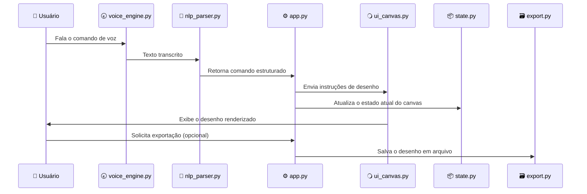

# 🎨 VoiceDraw

O **VoiceDraw** é um projeto de extensão universitária desenvolvido na **PUC-SP**, com foco em **acessibilidade e inclusão digital**.
Seu objetivo é permitir que qualquer pessoa — inclusive aquelas com limitações motoras — possa **desenhar usando apenas a voz**.

O sistema traduz comandos em português natural (como *“desenhar círculo azul de raio 100”*) em instruções estruturadas e renderiza o desenho em tempo real por meio do **Tkinter**.

---

## 🧠 Visão geral

O VoiceDraw combina **Processamento de Linguagem Natural (NLP)**, **reconhecimento de voz** e **renderização gráfica** para criar uma interface acessível e educativa.
Cada componente foi projetado para ser modular, simples e facilmente compreendido por estudantes e desenvolvedores interessados em explorar integração entre **voz e interação gráfica**.

---

## 🎗️ Arquitetura geral



---

## ⚙️ Instalação e execução

> Para um guia detalhado com imagens e passos, consulte [`docs/setup.md`](docs/setup.md).

### Pré-requisitos

* Python 3.10+
* Microfone funcional
* Sistema operacional com suporte a Tkinter

### Instalação rápida

```bash
git clone git@github.com:cesarsantana2/voice-draw.git
cd voice-draw
python3 -m venv .venv
source .venv/bin/activate
pip install -r requirements.txt
python app.py
```

Ao iniciar, o programa abrirá a janela gráfica e começará a escutar comandos de voz.

---

## 🗣️ Exemplo de uso

**Comando de voz:**

> “Desenhar triângulo vermelho de lado 200 na posição x 300 y 300”

**Resultado esperado:**
O programa desenhará um triângulo vermelho no canvas com os parâmetros fornecidos.

---

## 📚 Documentação dos módulos

| Módulo               | Descrição                                           | Link                                                       |
| -------------------- | --------------------------------------------------- | ---------------------------------------------------------- |
| 🎤 `voice_engine.py` | Captura e transcreve voz em texto.                  | [docs/models/voice_engine.md](docs/models/voice_engine.md) |
| 🧙 `nlp_parser.py`   | Interpreta frases e extrai parâmetros estruturados. | [docs/models/nlp_parser.md](docs/models/nlp_parser.md)     |
| ⚙️ `app.py`          | Núcleo controlador da aplicação.                    | [docs/models/app.md](docs/models/app.md)                   |
| 🔾 `ui_canvas.py`    | Responsável por renderizar formas no Tkinter.       | [docs/models/ui_canvas.md](docs/models/ui_canvas.md)       |
| 🧮 `state.py`        | Armazena o estado atual do desenho.                 | [docs/models/state.md](docs/models/state.md)               |
| 🗃 `export.py`       | Exporta o desenho para arquivos de imagem.          | [docs/models/export.md](docs/models/export.md)             |
| 🔳 `shapes.py`       | Define funções utilitárias para formas geométricas. | [docs/models/shapes.md](docs/models/shapes.md)             |

---

## 🌍 Contexto extensionista

O VoiceDraw foi concebido como parte de um **projeto de extensão da PUC-SP**, promovendo o uso de tecnologias abertas para inclusão digital.
Seu propósito é **ampliar a autonomia de pessoas com restrições motoras** e demonstrar, de forma prática, como o uso de **voz e IA** pode reduzir barreiras de acesso ao mundo digital.

Mais detalhes sobre o contexto do projeto e seus objetivos sociais podem ser encontrados em:
🔗 [`docs/overview.md`](docs/overview.md)

---

## 🧑‍💻 Estrutura de diretórios

```
voice-draw/
├── app.py
├── nlp_parser.py
├── ui_canvas.py
├── state.py
├── export.py
├── shapes.py
├── voice_engine.py
├── requirements.txt
├── docs/
│   ├── setup.md
│   ├── overview.md
│   └── models/
│       ├── app.md
│       ├── nlp_parser.md
│       ├── ui_canvas.md
│       ├── state.md
│       ├── export.md
│       ├── shapes.md
│       └── voice_engine.md
└── README.md
```

---

## 🥉 Tecnologias utilizadas

* **Python 3.10+**
* **Tkinter** (interface gráfica)
* **SpeechRecognition** (reconhecimento de voz)
* **PyAudio** (captura de microfone)
* **Regex / NLP básico** (interpretação de texto)
* **Pillow** (exportação de imagens)

---

## 🤝 Contribuição

Este é um projeto educacional e aberto.
Sinta-se à vontade para abrir *issues*, sugerir melhorias e propor novos recursos de acessibilidade.

---

## 📄 Licença

Este projeto é distribuído sob a licença MIT.
Consulte o arquivo `LICENSE` para mais informações.

---

> Desenvolvido com propósito e código aberto.
> Parte do programa de **Extensão em Computação Aplicada à Inclusão Digital — PUC-SP**.
