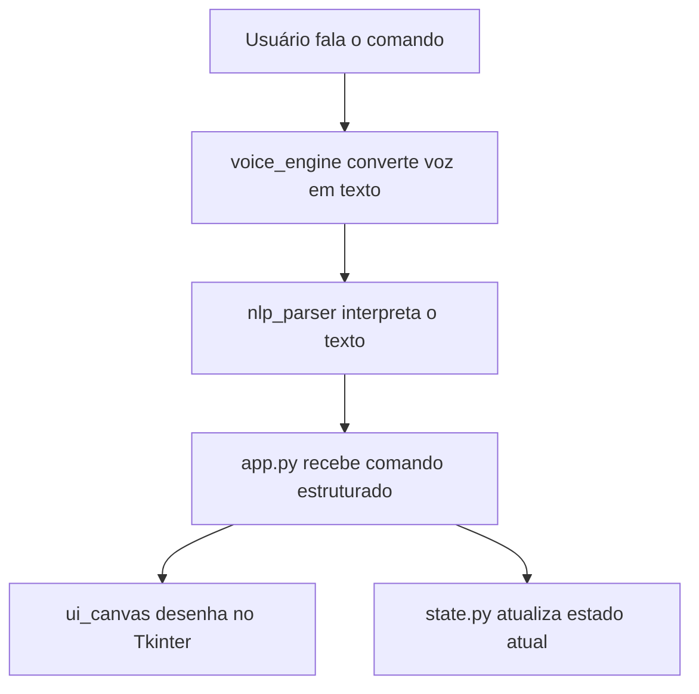

# `app.py`

O módulo `app.py` atua como o **núcleo controlador** da aplicação VoiceDraw. Ele integra os componentes de interface, interpretação de voz e desenho em um fluxo contínuo e reativo.

---

## Função principal

* Coordenar a comunicação entre os módulos:

  * `voice_engine.py` (captura de voz e conversão para texto)
  * `nlp_parser.py` (interpretação do texto em comandos estruturados)
  * `ui_canvas.py` (renderização dos desenhos na tela)
* Gerenciar o **loop principal da aplicação** (Tkinter).
* Manter o estado atual do canvas (formas, cores, histórico de comandos).

---

## Principais responsabilidades

* **Inicialização da aplicação**
  Cria a janela principal, define o tamanho, título e inicializa o canvas.

* **Integração com o `voice_engine`**
  Escuta o microfone e converte comandos de voz em texto compreensível.

* **Interpretação de comandos**
  Recebe o texto do `voice_engine`, envia para o `nlp_parser` e processa o resultado retornado.

* **Execução de ações no canvas**
  Com base na saída do parser, desenha formas geométricas ou limpa o canvas.

* **Tratamento de erros e feedback**
  Exibe mensagens de erro ou comandos não reconhecidos na interface, mantendo a aplicação responsiva.

---

## Fluxo geral



---

## Exemplo de fluxo de execução

1. O usuário diz: **“Desenhar círculo azul de raio 50 no centro.”**
2. O `voice_engine` converte a fala em texto: `"desenhar círculo azul de raio 50 no centro"`.
3. O `nlp_parser` retorna um dicionário estruturado:

   ```json
   {
     "ok": true,
     "shape": "circle",
     "color": "blue",
     "radius": 50,
     "x": 250,
     "y": 250,
     "thickness": 2,
     "fill": false
   }
   ```
4. O `app.py` envia os dados para `ui_canvas.draw_shape()`.
5. A forma é renderizada no canvas.

---

## Estrutura resumida

```python
from voice_engine import listen_and_transcribe
from nlp_parser import parse_command
from ui_canvas import draw_shape

# Inicialização da aplicação
def main():
    text = listen_and_transcribe()
    cmd = parse_command(text)

    if cmd["ok"]:
        draw_shape(cmd)
    else:
        print("Erro:", cmd["hint"])

if __name__ == "__main__":
    main()
```

---

## Observações técnicas

* O módulo `app.py` é o **ponto de entrada** da aplicação VoiceDraw.
* Usa o `Tkinter` para a interface e o loop principal de eventos.
* Trabalha de forma **reativa e modular**, permitindo substituição de componentes (ex: trocar o motor de voz sem alterar o parser).
* Pode ser executado diretamente via:

  ```bash
  python3 app.py
  ```

---

> **Resumo:**
> O `app.py` é o orquestrador do VoiceDraw. Ele conecta voz, interpretação semântica e desenho em uma experiência integrada e interativa.