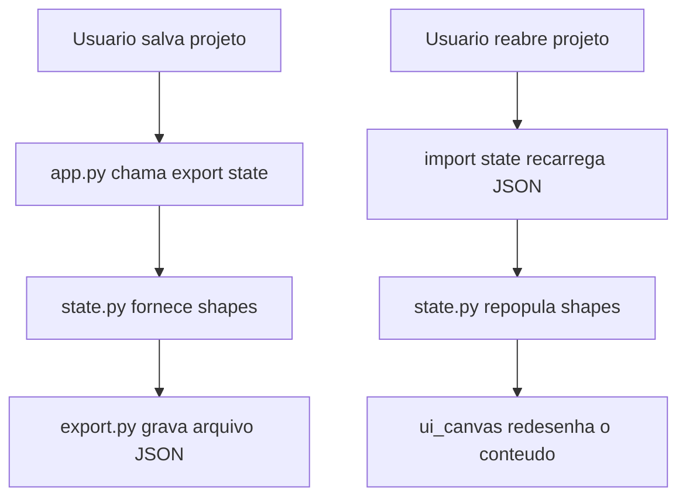

# `export.py`

O módulo `export.py` é responsável por **salvar, carregar e exportar o estado do desenho**. Ele funciona como a ponte entre o `state.py` e arquivos externos, permitindo que o usuário grave o progresso ou gere arquivos reutilizáveis e compartilháveis.

---

## Função principal

* Converter o estado atual (lista de formas e comandos) em JSON;
* Exportar o conteúdo para um arquivo local (`.json`, `.txt` ou outro formato simples);
* Permitir importação de estados anteriores para restaurar o canvas.

---

## Principais responsabilidades

* **Exportar o estado atual para JSON**
  Serializa o dicionário mantido em `state.py` e salva em arquivo com nome e caminho definidos.

* **Importar um estado existente**
  Lê um arquivo `.json` previamente salvo e reconstrói o estado do canvas.

* **Facilitar integrações externas**
  O arquivo JSON exportado pode ser lido por outras ferramentas (por exemplo, para análise ou reprodução automatizada).

* **Gerar logs legíveis**
  Pode também gerar uma versão textual (`.txt`) com os comandos de voz e ações executadas.

---

## Estrutura geral do módulo

```python
import json

def export_state(state, filename="voice_draw_state.json"):
    with open(filename, "w", encoding="utf-8") as f:
        json.dump(state, f, indent=4, ensure_ascii=False)
    print(f"Estado exportado com sucesso para {filename}.")


def import_state(filename="voice_draw_state.json"):
    try:
        with open(filename, "r", encoding="utf-8") as f:
            state = json.load(f)
        print(f"Estado importado de {filename}.")
        return state
    except FileNotFoundError:
        print("Arquivo de estado não encontrado.")
        return []
```

---

## Fluxo de uso



---

## Exemplo de uso

```python
from export import export_state, import_state

# Exemplo de estado atual
data = [
    {"shape": "circle", "x": 200, "y": 200, "radius": 80, "color": "blue"},
    {"shape": "square", "x": 50, "y": 50, "side": 100, "color": "red"}
]

# Exporta para arquivo JSON
export_state(data, "meu_desenho.json")

# Importa novamente
restaurado = import_state("meu_desenho.json")
print(restaurado)
```

---

## Integração com `state.py`

O módulo `export.py` depende diretamente do `state` para acessar as informações atuais.
Normalmente é chamado via `app.py` quando o usuário solicita salvar o trabalho.

```python
from export import export_state
from state import State

state = State()
state.add_shape({"shape": "line", "x": 10, "y": 10, "x2": 100, "y2": 50})
export_state(state.shapes)
```

---

## Observações técnicas

* Usa apenas bibliotecas padrão do Python (`json`, `os`);
* Garante compatibilidade multiplataforma (Windows, macOS, Linux);
* É modular — pode ser substituído por um exportador mais sofisticado (ex: `.png` via `PIL` ou `.svg` via `cairosvg`);
* Todos os dados exportados são **humanamente legíveis**.

---

> **Resumo:**
> O `export.py` é o módulo de persistência do VoiceDraw. Ele transforma o estado atual do canvas em um arquivo que pode ser salvo, compartilhado e recarregado posteriormente.
