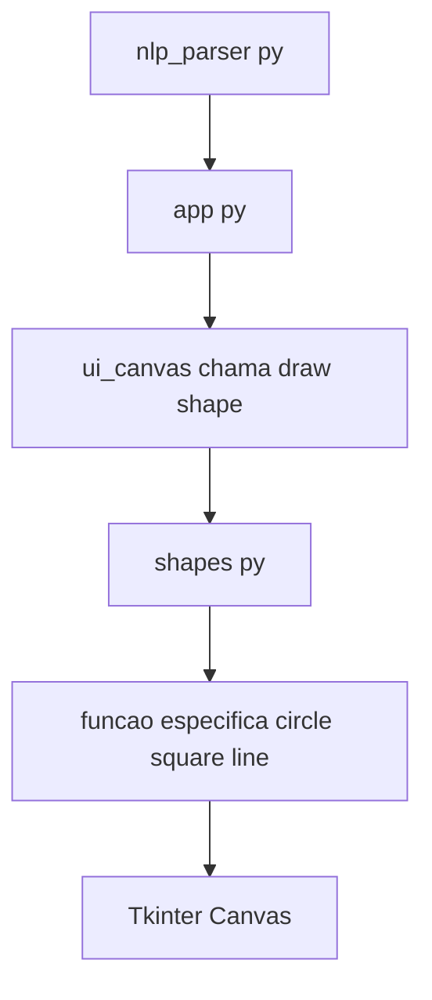

# `shapes.py`

O módulo `shapes.py` define as **funções responsáveis por desenhar formas geométricas individuais** no canvas da aplicação. Cada função recebe um dicionário de parâmetros estruturados (gerado pelo `nlp_parser`) e desenha a forma correspondente no contexto do `ui_canvas`.

---

## Função principal

* Implementar funções específicas de desenho: círculo, quadrado, triângulo, linha e ponto.
* Calcular coordenadas baseadas nos parâmetros fornecidos (x, y, raio, lado, etc.).
* Aplicar cores, espessura de linha e preenchimento.

---

## Principais responsabilidades

* **Desenhar círculo**
  Usa `canvas.create_oval()` para gerar um círculo a partir do centro `(x, y)` e raio definido.

* **Desenhar quadrado e retângulo**
  Calcula os vértices com base em `x`, `y` e `lado`, e usa `canvas.create_rectangle()`.

* **Desenhar triângulo**
  Constrói um triângulo equilátero ou isósceles a partir de coordenadas base e lado.

* **Desenhar linha**
  Usa coordenadas `(x1, y1, x2, y2)` para criar uma linha simples via `canvas.create_line()`.

* **Desenhar ponto**
  Representa um pequeno círculo (raio fixo pequeno) para simular um ponto visível.

---

## Estrutura geral do módulo

```python
def draw_circle(canvas, cmd):
    x = cmd.get("x", 100)
    y = cmd.get("y", 100)
    r = cmd.get("radius", 50)
    color = cmd.get("color", "black")
    fill = color if cmd.get("fill") else ""

    canvas.create_oval(x - r, y - r, x + r, y + r, outline=color, fill=fill, width=cmd.get("thickness", 2))


def draw_square(canvas, cmd):
    x = cmd.get("x", 100)
    y = cmd.get("y", 100)
    side = cmd.get("side", 100)
    color = cmd.get("color", "black")
    fill = color if cmd.get("fill") else ""

    canvas.create_rectangle(x, y, x + side, y + side, outline=color, fill=fill, width=cmd.get("thickness", 2))


def draw_line(canvas, cmd):
    x1, y1 = cmd.get("x", 0), cmd.get("y", 0)
    x2, y2 = cmd.get("x2", 100), cmd.get("y2", 100)
    color = cmd.get("color", "black")
    canvas.create_line(x1, y1, x2, y2, fill=color, width=cmd.get("thickness", 2))
```

---

## Fluxo interno



---

## Exemplo de uso

```python
from tkinter import Tk, Canvas
from shapes import draw_circle

root = Tk()
canvas = Canvas(root, width=400, height=400)
canvas.pack()

draw_circle(canvas, {"x": 200, "y": 200, "radius": 80, "color": "red", "fill": True})

root.mainloop()
```

---

## Observações técnicas

* As funções de `shapes.py` são **puramente gráficas**, não realizam parsing de texto.
* São chamadas apenas pelo `ui_canvas`.
* Cada função deve validar parâmetros e evitar erros de chave ausente.
* Coordenadas e tamanhos são tratados em pixels (valores inteiros).
* Fácil de estender para novas formas (ex: polígono, estrela, elipse).

---

> **Resumo:**
> O `shapes.py` é o módulo gráfico de baixo nível do VoiceDraw. Ele recebe parâmetros já interpretados e executa o desenho real no canvas Tkinter.
