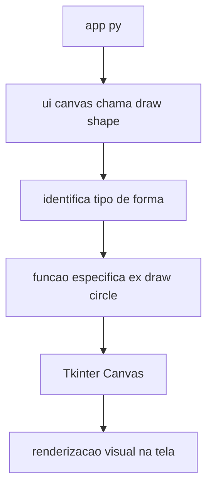

# `ui_canvas.py`

O módulo `ui_canvas.py` é responsável por gerenciar a **interface gráfica** do VoiceDraw. Ele cria o **canvas principal (Tkinter)** onde as formas reconhecidas são desenhadas e controladas.

---

## Função principal

* Criar e configurar o canvas da aplicação (`Tkinter.Canvas`);
* Renderizar formas geométricas a partir das instruções vindas do `app.py`;
* Exibir mensagens visuais e a grade auxiliar para orientação de coordenadas.

---

## Principais responsabilidades

* **Inicialização do Canvas**

  * Define tamanho, cor de fundo e escala.
  * Adiciona atalhos de teclado (por exemplo, tecla `G` para ativar/desativar a grade).

* **Desenho de formas**

  * Recebe um dicionário estruturado do `nlp_parser` via `app.py`.
  * Chama a função correspondente para desenhar a forma:

    * `draw_circle()`
    * `draw_square()`
    * `draw_triangle()`
    * `draw_line()`
    * `draw_point()`

* **Gerenciamento da grade**

  * Permite alternar entre visualização com ou sem grade.
  * A grade ajuda a guiar a posição das coordenadas X e Y.

* **Limpeza e atualização**

  * Funções como `clear_canvas()` e `refresh()` removem ou redesenham elementos.

---

## Exemplo de fluxo de execução

```python
from tkinter import Tk, Canvas
from ui_canvas import draw_shape

root = Tk()
canvas = Canvas(root, width=800, height=600, bg="white")
canvas.pack()

cmd = {
  "ok": True,
  "shape": "circle",
  "color": "blue",
  "radius": 100,
  "x": 300,
  "y": 300,
  "thickness": 3,
  "fill": False
}

draw_shape(canvas, cmd)
root.mainloop()
```

---

## Estrutura geral do módulo

```python
def draw_shape(canvas, cmd):
    """Recebe um dicionário com os parâmetros e desenha a forma correspondente."""
    shape = cmd.get("shape")
    color = cmd.get("color", "black")
    fill = cmd.get("fill", False)

    if shape == "circle":
        draw_circle(canvas, cmd)
    elif shape == "square":
        draw_square(canvas, cmd)
    elif shape == "triangle":
        draw_triangle(canvas, cmd)
    elif shape == "line":
        draw_line(canvas, cmd)
    elif shape == "point":
        draw_point(canvas, cmd)
    else:
        print("Forma não reconhecida:", shape)
```

---

## Fluxo gráfico geral



---

## Observações técnicas

* Todas as coordenadas são em pixels (inteiros).
* Usa o **Tkinter nativo**, sem dependências externas.
* Pode ser testado sem microfone, apenas chamando funções manualmente.
* Ideal para depuração de layout e formas.

---

> **Resumo:**
> O `ui_canvas.py` é o módulo responsável por desenhar. Ele recebe o comando processado, identifica o tipo de forma e renderiza o resultado visual no canvas principal.
