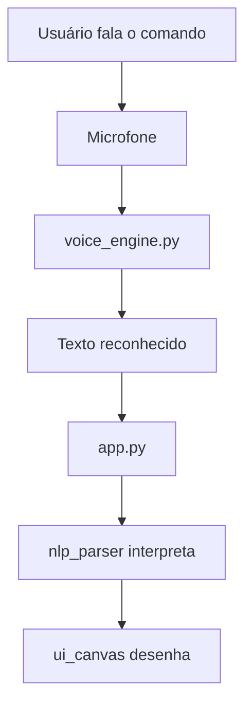

# `voice_engine.py`

O módulo `voice_engine.py` é responsável por **capturar comandos de voz do microfone** e transformá-los em texto compreensível pela aplicação. Ele é o ponto de entrada para a interação por voz do VoiceDraw.

---

## Função principal

* Capturar áudio em tempo real usando o microfone;
* Converter fala em texto utilizando uma biblioteca de reconhecimento de voz (ex: `speech_recognition`);
* Retornar o texto para o módulo `app.py` para ser interpretado pelo `nlp_parser.py`.

---

## Principais responsabilidades

* **Inicialização do reconhecimento de voz**

  * Configura o microfone e define parâmetros de sensibilidade e tempo de escuta.
  * Exibe mensagens no terminal como “Fale seu comando agora...”.

* **Escuta e transcrição**

  * Usa a função `listen_and_transcribe()` para capturar a fala e convertê-la em texto.
  * Implementa tratamento de erros (ex: microfone desconectado, ruído, timeout, ou ausência de fala).

* **Integração com `app.py`**

  * Quando uma frase é reconhecida, o texto resultante é enviado ao `app.py` para interpretação.
  * O `app.py` chama o `nlp_parser` para processar o texto e decidir o que desenhar.

* **Feedback ao usuário**

  * Informa no console quando está ouvindo e quando processou com sucesso o comando de voz.

---

## Exemplo de fluxo de execução

```python
import speech_recognition as sr

def listen_and_transcribe():
    recognizer = sr.Recognizer()
    with sr.Microphone() as source:
        print("Fale seu comando...")
        audio = recognizer.listen(source)

    try:
        text = recognizer.recognize_google(audio, language="pt-BR")
        print(f"Você disse: {text}")
        return text
    except sr.UnknownValueError:
        print("Não foi possível entender o áudio.")
        return ""
    except sr.RequestError:
        print("Erro ao se conectar com o serviço de reconhecimento.")
        return ""
```

---

## Fluxo geral de integração



---

## Observações técnicas

* O módulo depende de bibliotecas externas como `speech_recognition` e `pyaudio` (no caso do microfone).
* A latência pode variar de acordo com a qualidade do áudio e conexão de rede.
* Em ambientes sem microfone, pode-se substituir a entrada de áudio por um arquivo `.wav` para testes.
* Pode ser facilmente substituído por outro motor de voz (ex: Whisper, Vosk, Google Speech-to-Text, etc.) desde que mantenha a mesma assinatura de função (`listen_and_transcribe`).

---

## Exemplo de uso integrado

```python
from voice_engine import listen_and_transcribe
from nlp_parser import parse_command

text = listen_and_transcribe()
cmd = parse_command(text)
print(cmd)
```

---

> **Resumo:**
> O `voice_engine.py` é o módulo que dá voz ao VoiceDraw. Ele transforma áudio em texto e entrega comandos em português para o núcleo da aplicação.
